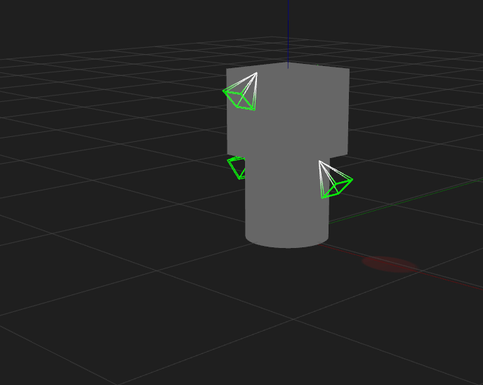

# Flashlight Plugin Introduction



FlashLightPlugin is a [model plugin](/tutorials?tut=plugins_model&cat=write_plugin) included with gazebo that flashes and dims lights on a model. By giving parameters to the plugin, you can choose which lights to blink and also specify the duration and interval time of flashing for each of lights. By inheriting this plugin, you can also use internal features, e.g., dynamically turning the lights on/off.

# Usage and Plugin Parameters
Under `<model>` element, insert <plugin> element with `filename` attribute which is set to `libFlashLightPlugin.so`. In the following example (the world file is available [here](https://bitbucket.org/osrf/gazebo/raw/gazebo9/worlds/flash_light_plugin_demo.world)), the model has two links each of which has two light elements.

```XML
<model name='light_model'>
  <static>1</static>
  <pose frame=''>0 0 0 0 -0 0</pose>
  <link name='cylinder'>

    ...

    <light name='light_source1' type='spot'>

      ...

    </light>
    <light name='light_source2' type='spot'>

      ...

    </light>

    ...

  </link>
  <link name='box'>

    ...

    <light name='light_source3' type='spot'>

      ...

    </light>
    <light name='light_source4' type='spot'>

      ...

    </light>

    ...

  </link>

  ...

  <plugin name='light_control' filename='libFlashLightPlugin.so'>
    <enable>true</enable>
    <flash_light>
      <light_id>cylinder/light_source1</light_id>
      <duration>0.5</duration>
      <interval>0.5</interval>
    </flash_light>
    <flash_light>
      <light_id>cylinder/light_source2</light_id>
      <duration>0.3</duration>
      <interval>1.2</interval>
    </flash_light>
    <flash_light>
      <light_id>box/light_source3</light_id>
      <duration>1.0</duration>
      <interval>0.1</interval>
      <enable>false</enable>
    </flash_light>
    <flash_light>
      <light_id>box/light_source4</light_id>
      <duration>1.0</duration>
      <interval>0.3</interval>
      <enable>true</enable>
    </flash_light>
  </plugin>
</model>
```

The following items are the parameters which the plugin takes.
## `<flash_light>`
This element represents a unit of settings for each flashlight. It can contain the following items. You can place this element as many as the number of light elements which your model has.

## `<light_id>`
This element is required for `<flash_light>`. It specifies which light you are going to control. It is composed of the link name followed by a slash "/" and the light name. In the example, you have a `<light>` named "light_source1" under the `<link>` named "cylinder". So the `<light_id>` should be "cylinder/light_source1".

## `<duration>`
This element is required for `<flash_light>`. It specifies how long time the light must flash in seconds.

## `<interval>`
This element is required for `<flash_light>`. It specifies how long time the light must dim in seconds. If it is set to 0, the light will be static.

## `<enable>`
This element is optional. When it is given under the plugin, it specifies whether all the lights are enabled or not. If it is placed directly under an individual `<flash_light>`, it overrides the global one and affects the corresponding light.

# How Do They Do It?
The diagram below shows an abstract structure of the plugin and its components. `FlashLightPlugin` class holds `FlashLightSetting` objects, each of which holds a unit of settings and maintains the corresponding light element by the Gazebo transport topic.

<!-- diagram showing classes -->


## FlashLightSetting class
Once the plugin is loaded, it reads the parameters given under the `<plugin>` element. For each `<flash_light>` element, an object of `FlashLightSetting` is created with the given parameters.

To flash/dim the light, `FlashLightSetting` class has two functions: `Flash()` and `Dim()`. It continuously checks the simulation time and finds the right timing to call those functions. Let's say the light to control is now flashing. When the duration time has been passed, it calls `Dim()`. Then, it waits until the interval time is passes. After that, it calls `Flash()`, and repeats these steps above.

## ~/light/modify topic
Gazebo advertises `~/light/modify` topic to update lights in the simulation. `Flash()` and `Dim()` store values in [msgs::Light](https://bitbucket.org/osrf/gazebo/src/gazebo9/gazebo/msgs/light.proto) and send it to this topic so a light appearance reflects to the specified values. Particularly, `Flash()` sets `range` to a non-zero value, and `Dim()` sets it to 0.

# Extension of Plugin
You can extend the functionalities of this plugin by creating an inheriting class. The figure below shows a child class. It can use the protected functions of `FlashLightPlugin` while interacting with external entities.

<!-- diagram of extended plugin class -->

`FlashLightPlugin` has the following protected functions so a child class can dynamically update the lights.

## Turning Lights On/Off
By specifying the link and light names as function parameters, `TurnOn()` and `TurnOff()` enable/disable an individual light respectively. `TurnOnAll()` and `TurnOffAll()` enable/disable all the lights at once.

## Changing Duration/Interval
You can also update the duration and interval time.

# Extension of Setting class
You can also add functionalities at the exact timing when the light flashes and dims, by extending the `FlashLightSetting` class. This lets you synchronize other entities (such as visual objects) with the lights.

<!-- diagram of extended plugin class + setting class -->

## Instantiation and Initialization

## Flash/Dim
<!-- Flash/Dim -->

## Possible Scenario
