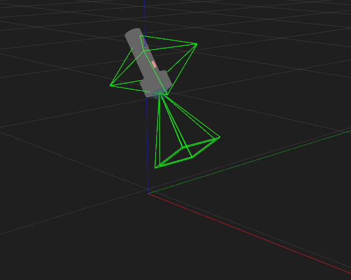
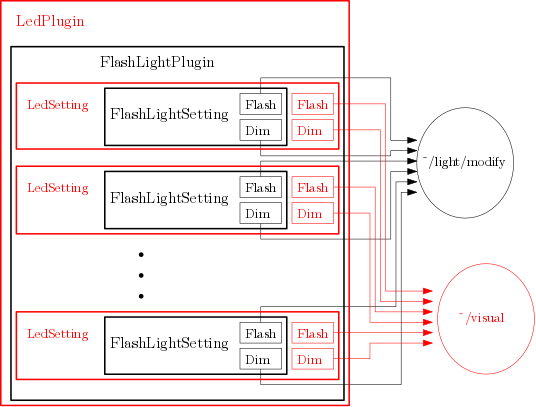

# LED Plugin Introduction



LedPlugin is a [model plugin](/tutorials?tut=plugins_model&cat=write_plugin) included with gazebo that synchronously flashes and dims light and visual objects on a model. By giving parameters to the plugin, you can choose which lights and visuals to blink, and you can also specify the duration and interval time of flashing for each of lights. By inheriting this plugin, you can also use internal features, e.g., dynamically turning the lights on/off.

# Usage and Plugin Parameters
Under `<model>` element, insert <plugin> element with `filename` attribute which is set to `libLedPlugin.so`. In the following example (the world file is available [here](https://bitbucket.org/osrf/gazebo/raw/gazebo9/worlds/led_plugin_demo.world)), the model has two links each of which has two light elements.

This plugin is an inheritance of [FlashLightPlugin](/tutorials?tut=flashlight_plugin&cat=plugins), so it takes the same parameters as the base plugin does. The difference is that, when you place a `<visual>` object with the name of the `<light>` object under the same `<link>` object, it will blink at the same timing.

```XML
<model name='light_model'>

  ...

  <link name='link'>

    ...

    <light name='lamp' type='spot'>

      ...

    </light>
    <visual name='lamp'>

      ...

    </visual>

    ...

  </link>

  ...

  <plugin name='light_control' filename='libLedPlugin.so'>
    <flash_light>
      <light_id>link/lamp</light_id>
      <duration>0.5</duration>
      <interval>0.5</interval>
    </flash_light>

    ...

  </plugin>
</model>
```

# How Do They Do It?
The diagram below shows an abstract structure of the plugin and its components.
`LedPlugin` class holds `LedSetting` objects, each of which holds a unit of settings and maintains the corresponding light element by the Gazebo transport topic. `LedPlugin` and `LedSetting` are child classes of `FlashLightPlugin` and `FlashLightSetting` respectively so they have the functionalities of the base classes.



They advertises to the topic `~/visual` to update the specified `<visual>` objects. As `Flash()` and `Dim()` are called, `LedSetting()` publishes a message to this topic.
